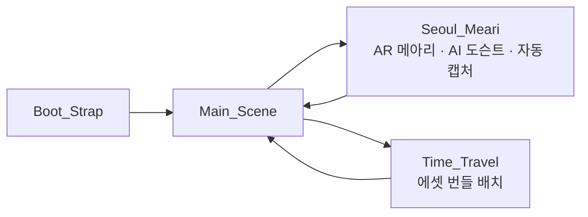
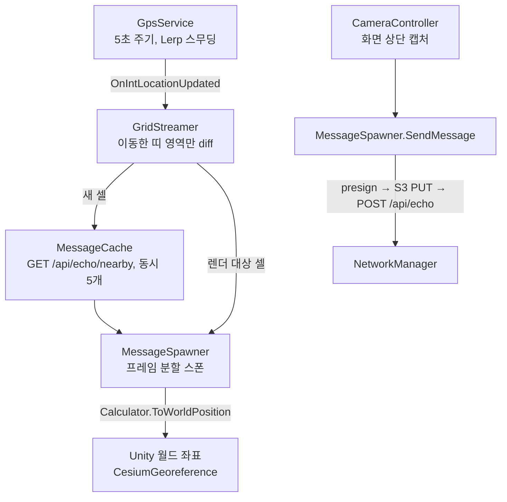
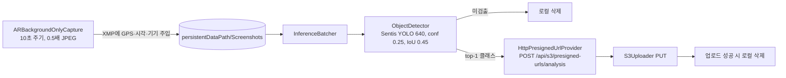
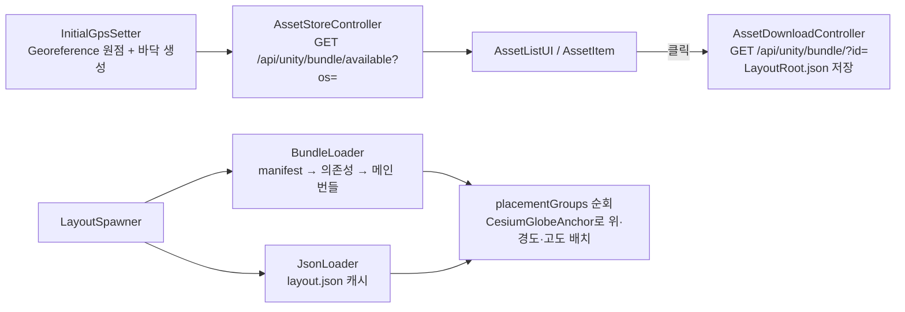

<p align="center">
  
</p>

# Seoul Meari Client

서울 메아리(Seoul Meari)의 Unity 모바일 AR 앱입니다. 서울 도심에서 GPS 위치에 메시지를 남기고 주변 사람의 메시지를 AR로 보는 **AR 메아리**, 서버에서 받은 에셋 번들을 실제 좌표에 배치해 옛 건축물을 재현하는 **타임 트래블**, AR 배경을 온디바이스 YOLO로 분석해 도시 문제를 자동 신고하는 **AI 도시 진단**, 사진과 위치로 질문하는 **AI 도슨트**를 제공합니다.

| 구분 | 내용 |
|---|---|
| 엔진 | Unity 2022.3.62f1 (Built-in RP), IL2CPP |
| 플랫폼 | Android (minSdk 24), iOS 12.0+ |
| AR | AR Foundation 5.2 (ARCore / ARKit) |
| 지리 좌표 | Cesium for Unity 1.18 (`CesiumGeoreference`, `CesiumGlobeAnchor`, WGS84 → ECEF → Unity) |
| 온디바이스 AI | Unity Sentis 2.1.3 + YOLO ONNX (`best.onnx`, 클래스 `sld` / `slp`) |
| 기타 | Unity Localization 1.5 (ko / en / ja), Newtonsoft JSON, TextMeshPro, AssetBundle |
| 백엔드 | [Seoul_Meari_Backend](https://github.com/Team-Little-Brother/Seoul_Meari_Backend) REST API (`/api`) |

## 서울 메아리 프로젝트

| 저장소 | 역할 |
|---|---|
| **Seoul_Meari_Client** (현재) | Unity 모바일 AR 앱 |
| [Seoul_Meari_Backend](https://github.com/Team-Little-Brother/Seoul_Meari_Backend) | NestJS REST API — 메아리 저장·조회, Presigned URL, 도슨트(Bedrock), 번들 메타데이터 |
| [Seoul_Meari_AI_Analysis](https://github.com/Team-Little-Brother/Seoul_Meari_AI_Analysis) | FastAPI 배치 분석 — 앱이 올린 사진을 Bedrock으로 진단해 민원 생성 |
| [Seoul_Meari_manage_Client](https://github.com/Team-Little-Brother/Seoul_Meari_manage_Client) | React 관리자 콘솔 — 진단 결과·메아리·VR 번들 관리 |

## 씬 구성과 흐름



### Boot_Strap — 앱 초기화

`Bootstrapper`가 다음 순서로 초기화하고 실패 지점에 따라 안내 UI를 띄웁니다.

1. `NetworkManager.CheckServerStatus()` — `GET /api/health`를 타임아웃(10s)까지 2초 간격으로 재시도
2. `PermissionManager` — 위치 권한(Android FineLocation / iOS 위치 서비스)과 카메라 권한 확인, 거부 시 설정 화면 이동 버튼 표시
3. `InitialLocation` — 최초 GPS 1회 측정
4. `MessageCache.InitiateMessage()` — 현재 위치 기준 5×5 격자 셀의 메아리를 미리 가져와 캐시
5. `PipelineController.StartYoloPipeline()` — 이전 세션에서 남은 캡처 이미지를 검출·업로드
6. `Main_Scene` 로드

### Main_Scene — 메뉴

AR 메아리 / 타임 트래블 진입 버튼과 언어 선택 드롭다운(`LanguageDropdown`, 선택값은 `PlayerPrefs`에 저장)이 있습니다.

### Seoul_Meari — AR 메아리



- **좌표 격자**: `GridConfig`가 위·경도를 `1e-5° × 10`(약 10m) 단위 셀로 양자화합니다. `GpsService`가 셀이 바뀔 때만 이벤트를 내고, `GridStreamer.DiffBands()`가 이전/현재 셀을 비교해 새로 들어온 띠(row/column)만 요청·렌더 큐에 넣습니다. 데이터 셀은 5×5, 렌더 셀은 3×3입니다.
- **위치 → 월드 좌표**: `CesiumGeoreference`의 원점을 현재 GPS로 맞추고(`CesiumInitialSetting`), 각 메시지의 위·경도를 `CesiumWgs84Ellipsoid`로 ECEF 변환 후 Unity 좌표로 바꿉니다(`Calculator.ToWorldPosition`).
- **메시지 작성**: `CameraController.Capture()`가 UI를 잠시 숨기고 화면 위쪽 절반을 `Texture2D`로 읽어 미리보기에 넣습니다. 전송 시 `NetworkManager`가 `POST /api/s3/presigned-url/echo`로 URL을 받아 S3에 `PUT`한 뒤 `POST /api/echo`로 메시지를 저장합니다. 내 메시지는 `TemporaryMessageAnimator`로 위로 떠오르며 사라집니다.
- **이미지 지연 로드**: 서버 메시지의 이미지는 `RequestImage`가 탭 시점에 `GET /api/s3/presigned-url/echo/image`로 URL을 받아 내려받습니다.
- **AR 카메라 동기화**: `SyncToArCamera`가 AR 카메라의 포즈와 투영행렬을 게임 카메라에 복사합니다. AR 배경 카메라와 오브젝트 카메라를 분리한 구조입니다.

### Seoul_Meari — AI 도시 진단 (자동 캡처 → YOLO → S3)



- `ARBackgroundOnlyCapture`는 AR 배경 카메라의 `OnRenderImage`에서 UI·오브젝트 없이 카메라 영상만 캡처합니다. `XmpBuilder` + `JpegXmpInjector`가 JPEG APP1 세그먼트에 XMP(`exif:GPSLatitude/Longitude`, `xmp:CreateDate`, `tiff:Model`)를 넣어, 백엔드·분석 서버가 EXIF 없이도 촬영 위치를 읽을 수 있게 합니다.
- `ObjectDetector`는 `data.yaml`에서 클래스 이름을 읽고(`sld` 페트병·캔 등 단단한 쓰레기, `slp` 비닐·종이 등 비정형 쓰레기), 출력 텐서 레이아웃(`[cx,cy,w,h,obj,cls…]`, `[cx,cy,w,h,cls…]`, `[cx,cy,w,h,score,clsId]`)을 자동 판별한 뒤 클래스별 NMS를 수행합니다. GPU compute를 지원하면 GPU, 아니면 CPU 백엔드를 씁니다.
- 검출된 이미지는 최고 신뢰도 클래스를 `objectName`으로 붙여 Presigned URL을 받고, 서버가 만든 키(`upload_image/{날짜}/{시각}_{클래스}_{id}.jpg`)로 S3에 올립니다. 이후 [AI 분석 서버](https://github.com/Team-Little-Brother/Seoul_Meari_AI_Analysis)가 1시간마다 새 이미지를 진단해 민원을 만듭니다.
- 파이프라인은 부트스트랩 시와 AR 씬의 패널을 열 때(`PanelController.TogglePanel`) 실행됩니다.

### Seoul_Meari — AI 도슨트

`DocentService`가 캡처 이미지(JPEG 80), 현재 GPS 문자열, 질문을 `multipart/form-data`로 `POST /api/docent/question`에 보내고, 백엔드가 Bedrock Claude 3.5 Sonnet으로 만든 답변을 화면에 표시합니다.

### Time_Travel — 에셋 번들 배치



- `BundleLoader`는 매니페스트 번들에서 `AssetBundleManifest`를 읽어 의존성 순서대로 번들을 `persistentDataPath`에 캐시·로드합니다. `UrlUtil.ResolveSource()` 덕분에 HTTP URL과 `StreamingAssets` 상대 경로를 같은 방식으로 다룹니다.
- `LayoutSpawner`는 레이아웃 JSON의 `placementGroups`를 순회하며 프리팹을 비활성 상태로 생성한 뒤 `CesiumGlobeAnchor`에 위·경도·고도를 넣고 활성화합니다. `SpawnConfig`(ScriptableObject)의 `spawnPerFrame`으로 프레임을 분할합니다.
- `Assets/JejumokGwana/`에는 제주목관아 건축 요소(기둥·지붕·담장·계단 등) 프리팹과 데모 씬이 들어 있으며, 번들 제작 샘플로 사용됩니다.
- 현재 백엔드의 `/api/unity/bundle/...` 컨트롤러는 주석 처리되어 있어 에셋 스토어 목록 조회는 동작하지 않습니다. `LayoutSpawner`에 URL을 직접 지정하거나 `StreamingAssets`에 번들을 넣으면 배치 기능은 단독으로 테스트할 수 있습니다.

## 백엔드 API 사용 목록

| 용도 | 엔드포인트 |
|---|---|
| 헬스체크 | `GET /api/health` |
| 주변 메아리 | `GET /api/echo/nearby?lat&lon&z&degree` |
| 메아리 생성 | `POST /api/s3/presigned-url/echo` → S3 `PUT` → `POST /api/echo` |
| 메아리 이미지 | `GET /api/s3/presigned-url/echo/image?image-key=` |
| 진단 이미지 업로드 | `POST /api/s3/presigned-urls/analysis` → S3 `PUT` |
| 도슨트 | `POST /api/docent/question` |
| 에셋 번들 | `GET /api/unity/bundle/available?os=`, `GET /api/unity/bundle/?id=` (백엔드 미구현) |

## 프로젝트 구조

```
Assets/
├── Scenes/                      # Boot_Strap, Main_Scene, Seoul_Meari, Time_Travel
├── Scripts/
│   ├── BootStrap/               # Bootstrapper, PermissionManager, UIManager, InitialLocation, ScreenManager
│   ├── Global/
│   │   ├── NetworkManager.cs    # 모든 REST 호출 (UnityWebRequest, 코루틴 + 콜백)
│   │   ├── MessageCache.cs      # 셀 단위 메아리 캐시, 동시 요청 제한
│   │   ├── LanguageManager.cs   # Localization 로케일 전환·저장
│   │   ├── Config/              # GlobalConfig(ConfigProvider), GridConfig, ScreenshotConfig
│   │   └── Utils/               # Calculator(격자·ECEF), XmpBuilder, JpegXmpInjector, TimeFormatter
│   ├── SeoulMeariScene/
│   │   ├── AR/                  # MessageSpawner, MessageInfo, CesiumInitialSetting, TransferMessageAnimator
│   │   ├── Services/            # GpsService, GridStreamer, AutoScreenshotBuiltIn, DocentService, RequestImage
│   │   ├── Controllers/         # CameraController(캡처), PanelController
│   │   └── UI/                  # ARCameraManager(카메라 동기화), GpsTextGetter 등
│   ├── TimeTravelScene/
│   │   ├── Loading/             # BundleLoader, JsonLoader
│   │   ├── Spawning/            # LayoutSpawner, SpawnConfig
│   │   ├── Asset/               # AssetStoreController, AssetDownloadController
│   │   ├── Domain/              # LayoutTypes(LayoutRoot, PlacementGroup…), AssetBundleMetaTypes
│   │   └── UI/                  # AssetListUI, AssetItem
│   └── yolo_S3/
│       ├── Detection/           # ObjectDetector(Sentis), best.onnx, data.yaml
│       ├── Batch/               # InferenceBatcher, PhotoRepository
│       ├── Network/             # HttpPresignedUrlProvider, S3Uploader
│       └── Orchestration/       # PipelineController
├── Editor/                      # AssetBundle 빌드·검사 도구, UI 캡처 도구
├── Prefabs/                     # MessageServer, MessagePersonal, AssetListPrefab, Plane …
├── JejumokGwana/                # 제주목관아 3D 에셋(번들 샘플)
├── Lang/                        # Localization 테이블 (ko / en-US / ja)
├── AssetBundles/Android/        # 빌드된 번들과 메타데이터 JSON 샘플
└── Art/, Materials/, Shader/    # 로고, 배경, 그라디언트 버튼 셰이더 등
```

## 개발 환경 설정

1. Unity Hub에서 **2022.3.62f1**을 설치하고 프로젝트를 엽니다. 패키지는 `Packages/manifest.json`에 따라 자동 설치됩니다(Cesium은 `unity.pkg.cesium.com` 스코프 레지스트리).
2. **Git LFS**가 필요합니다. `.png`, `.jpg`, `.fbx`, `.psd`, 오디오 파일이 LFS로 관리됩니다.
   ```bash
   git lfs install
   git clone https://github.com/Team-Little-Brother/Seoul_Meari_Client.git
   ```
3. Cesium ion 토큰이 필요하면 `Assets/CesiumSettings/`에서 설정합니다. 현재 씬은 3D 타일보다 좌표 변환(`CesiumGeoreference`) 용도로 Cesium을 사용합니다.
4. 실기기에서 실행해야 GPS·AR·카메라가 동작합니다. 에디터에서는 권한 검사를 건너뛰지만 위치 서비스가 없어 AR 씬 기능 대부분이 동작하지 않습니다.

### 서버 주소

`NetworkManager`의 `baseUrl` 상수가 API 주소입니다. 로컬 백엔드로 테스트하려면 이 값을 `http://<PC IP>:3000/api`로 바꿉니다. `ConfigProvider`(환경 변수 `API_BASE_URL` → `StreamingAssets/config.local.json` → `Resources/config`)는 준비되어 있으나 아직 `NetworkManager`에 연결되지 않았습니다.

### 빌드

- Build Settings의 씬 순서: `Boot_Strap` → `Main_Scene` → `Seoul_Meari` → `Time_Travel`
- Android: minSdk 24, IL2CPP, ARCore 필요. iOS: 12.0+, `NSCameraUsageDescription`·위치 권한 문구 필요.

### 에셋 번들 제작 (Editor 메뉴)

| 메뉴 | 기능 |
|---|---|
| `Assets > Build AssetBundles > Build All` | 프로젝트의 모든 번들을 `Assets/AssetBundles/<플랫폼>/`에 빌드하고 번들별 메타데이터 JSON 생성 |
| `Assets > Build AssetBundles > Build Selected` | 선택한 에셋의 번들만 빌드 |
| `Assets > Build AssetBundles > Remove Unused Names` | 사용하지 않는 번들 이름 정리 |
| `Assets > Build AssetBundles > Clean Meta Files` | 빌드 폴더의 `.meta` 삭제 |
| `Assets > Build AssetBundles > Check Bundle Contents` | 번들에 포함된 에셋을 확인하는 에디터 창 |
| `Tools > Capture UI (Material-aware)` | UI 프리팹을 머티리얼 포함 PNG로 내보내기 |

`GenerateBundleMetadata`가 만든 JSON은 관리자 콘솔의 번들 업로드 시 레이아웃 파일의 기초로 쓸 수 있습니다. `placementGroups`(배치 위치)는 비어 있으므로 직접 채워야 합니다.

## 참고 사항

- GPS 고도는 사용하지 않고 `z = 0`으로 고정합니다. 메시지는 카메라 높이 기준 ±0.5m 범위에 무작위로 배치됩니다.
- `MessageData`는 `id`로 동일성을 판단해 같은 메시지를 중복 스폰하지 않습니다.
- 앱 실행 중 화면 꺼짐을 막기 위해 `Screen.sleepTimeout = NeverSleep`을 설정합니다.
- `PlayerRelativeSpawner`, `ForDebug`는 좌표 검증용 디버그 스크립트입니다.
